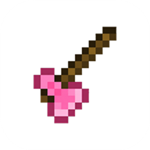

  
  <h1>AMCL</h1>
  
<strong>Axe Minecraft Launcher</strong>

  
面向 HarmonyOS NEXT 的 Minecraft Java Edition 启动器

  

    
    
  

  

    <a href="https://github.com/LZZLHY/amcl/releases/latest">下载最新版本</a> ·
    <a href="https://amcl.lovedhy.cn/docs/install-hokit">HoKit 安装指南</a> ·
    <a href="https://amcl.lovedhy.cn/privacy-policy.html">隐私政策</a> ·
    <a href="https://github.com/LZZLHY/amcl/issues">问题反馈</a>
  

## 项目简介

AMCL 在 HarmonyOS NEXT 上管理和启动 Minecraft Java Edition，提供版本管理、账户、模组加载器、JDK 路由、窗口输入、图形和音频兼容链路。

## 仓库内容

| 文件 | 用途 |
|---|---|
| [`MyApplication/`](MyApplication/) | 公开代码快照、运行时资源和构建说明 |
| [`update.json`](update.json) | 应用更新清单 |
| [`changelog.json`](changelog.json) | 应用版本变更数据 |
| [`assets/agc-icon-216.png`](assets/agc-icon-216.png) | AMCL 图标 |

GitHub Pages 只部署更新清单、更新日志和图标，首页与旧隐私页跳转到官网。公开源码通过本仓库拉取；Pages 发布不需要初始化第三方子模块。

## 从源码构建

工程根目录是 [`MyApplication/`](MyApplication/)，应当在 DevEco Studio 中打开这个目录。首次拉取需要准备锁定的第三方源码和 Java 依赖；仅下载 GitHub 源码 ZIP 不会包含 Git 子模块工作树和提交身份。

完整操作步骤、工具链版本、第三方依赖重建范围与常见错误见 [`公开快照构建说明`](MyApplication/docs/BUILD_SNAPSHOT.md)。源码导航见 [`架构概览`](MyApplication/docs/architecture.md)，依赖来源见 [`第三方组件说明`](MyApplication/docs/CREDITS.md)。

快照不含原始设备日志，仅保留构建所需的 [脱敏输入能力记录](MyApplication/docs/testing/gate0-raw-relative-evidence.md) 及其锁文件；它们保留原批准与风险接受事实，不构成新的设备验收。

本仓库提供应用代码快照及已纳入工程的运行时输入。构建时会重新生成 Java 启动层和应用 Native 库；MobileGL、SDL3、LWJGL Native 等输入沿用快照内经校验的预构建文件。自行编出 HAP、从源码重编所有第三方库、逐字节重现官方签名 Release 是不同的验证范围，构建说明分别列出了要求与限制。

## 代码与许可证

AMCL 自有代码位于 [`MyApplication/`](MyApplication/)，采用 [GPL-3.0-only](MyApplication/LICENSE)。第三方组件继续遵守各自许可证和来源说明，详见 [`MyApplication/NOTICE`](MyApplication/NOTICE) 与 [`MyApplication/docs/CREDITS.md`](MyApplication/docs/CREDITS.md)。

AMCL 与 Mojang Studios、Microsoft、Xbox、网易和华为终端有限公司无关联、无授权、无背书。Minecraft 及相关名称和商标归各自权利人所有。
